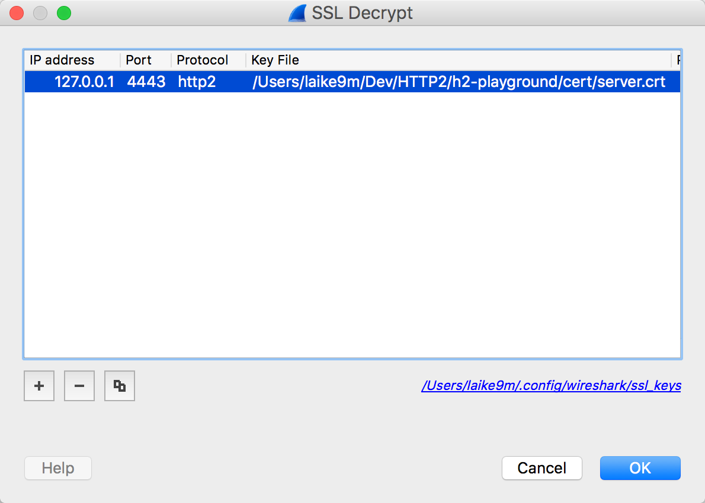
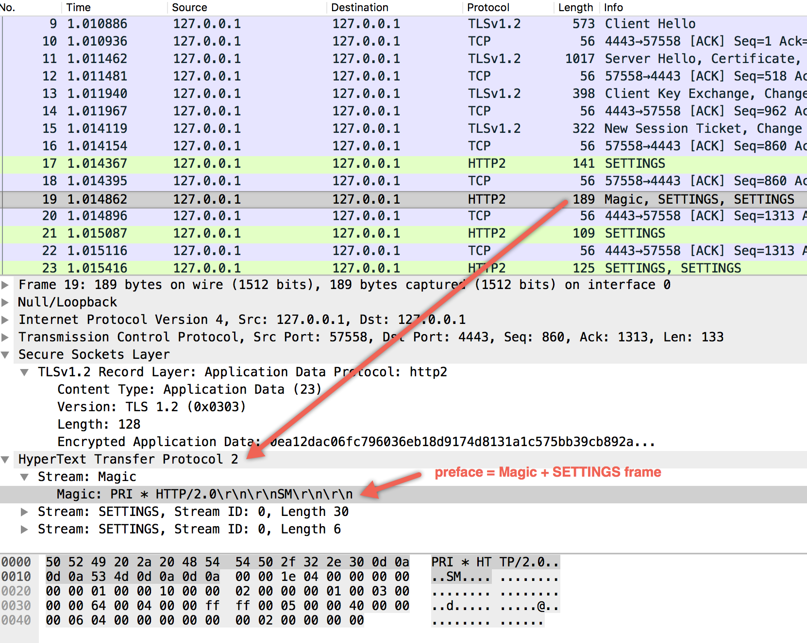

HTTP: Upgrade, or send H2 packet directly
HTTPS: ALPN

## Goal
* Don't rely on SSLKEYLOG and browser to analyze HTTP2 over TLS traffic.
* self-generated cert is enough for all testing.
* Run locally

## What's not included
* h2c, where HTTP2 is run over cleartext TCP
* HTTPS details except ALPN

## Requirement: 
* python supports APLN: 2.7.9+ or 3.5+
* wireshark
* openssl 1.0.2+

## Steps:
1. install hyper and hyper-h2
2. run h2-https-server.py
3. start listening on loopback in wireshark
4. run request.py

things to note:
* Don't use Diffie-Hellman cipher suite, cause SSLKEYLOG is necessary to decrypt traffic encrypted by DH.
* Eliminate warnings of not using DH cipher.
```python
hyper.tls._context.check_hostname = False
hyper.tls._context.verify_mode = ssl.CERT_NONE
```
* use "http2"


## Preface

both endpoints should send setting frame. When using h2, setting frame is the first data frame. preface = “PRI * HTTP/2.0\r\n\r\nSM\r\n\r\n” + SETTINGS frame



## SETTINGS Frame
